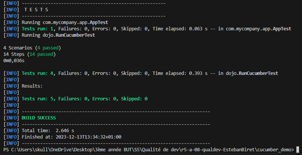
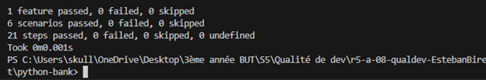

[](https://classroom.github.com/online_ide?assignment_repo_id=13207947&assignment_repo_type=AssignmentRepo)
= R5.A.08 -- Dépôt pour les TPs
:icons: font
:MoSCoW: https://fr.wikipedia.org/wiki/M%C3%A9thode_MoSCoW[MoSCoW]

Ce dépôt concerne les rendus de mailto:esteban.biret-toscano@etu.univ-tlse2.fr[Esteban BIRET-TOSCANO].

== TP1

Contenu du fichier `is_it_friday_yet.feature` :
[source,java]
---
Feature: Is it Friday yet?
Long live Saturday!
  Scenario Outline: Today is or is not Friday
    Given today is "<day>"
    When I ask whether it's Friday yet
    Then I should be told "<answer>"
  Examples:
    | day            | answer |
    | Friday         | TGIF   |
    | Sunday         | Nope, relax ! |
    | anything else! | Nope, relax ! |
---

Capture d'écran de l'exécution avec succès des tests :

image::resources/tests_tp1.png[]

== TP2

Contenu du fichier `Order.java` :
[source,java]
---
package dojo;
import java.util.ArrayList;
import java.util.List;
public class Order {
    private String owner ;
    private String target;
    private String msg;
    private List<String> cocktails;
    public Order() {
        this.owner = null;
        this.cocktails = new ArrayList<String>();
        this.target = null;
    }
    public void declareOwner(String nom) {
        this.owner = nom;
    }
    public String getOwner() {
        return this.owner;
    }
    public void declareTarget(String nom) {
        this.target = nom;
    }
    public String getTarget() {
        return this.target;
    }
    public List<String> getCocktails() {
        return this.cocktails;
    }
    public void declareMsg(String msg) {
        this.msg = msg;
    }
    public String getMsg(){
        return this.msg;
    }
}
---

Capture d'écran de l'exécution avec succès des tests :



== TP3

Contenu de mon fichier `bank.feature` : 

```
Feature: Bank Account
  Scenario Outline: Create an account and perform transactions
    Given a new user
    When the user creates an account with a balance of <initial_balance>
    And the user deposits <deposit_amount> into the account
    Then the user should have a balance of <expected_balance>
    Examples:
      | initial_balance | deposit_amount | expected_balance |
      | 0               | 50             | 50               |
      | 100             | 25             | 125              |
      | 200             | 100            | 300              |
  Scenario Outline: Withdraw from the account
    Given a user with a balance of <initial_balance>
    When the user withdraws <withdraw_amount> from the account
    Then the user should have a balance after withdrawal of <expected_balance_after_withdrawal>
    Examples:
      | initial_balance | withdraw_amount | expected_balance_after_withdrawal |
      | 150             | 50              | 100                               |
      | 300             | 100             | 200                               |
      | 500             | 200             | 300                               |

```

Contenu de mon fichier `steps.py` :


```python
from behave import *
from bank import BankAccount

# Given
@given(u'a new user')
def step_given_new_user(context):
    context.user_account = BankAccount()

@given(u'a user with a balance of {initial_balance}')
def step_given_user_with_balance(context, initial_balance):
    context.user_account = BankAccount()
    context.user_account.create_account(int(initial_balance))

# When
@when(u'the user creates an account with a balance of {initial_balance}')
def step_when_create_account(context, initial_balance):
    context.user_account.create_account(int(initial_balance))

@when(u'the user deposits {deposit_amount} into the account')
def step_when_deposit(context, deposit_amount):
    context.user_account.deposit(int(deposit_amount))

@when(u'the user withdraws {withdraw_amount} from the account')
def step_when_withdraw(context, withdraw_amount):
    context.user_account.withdraw(int(withdraw_amount))

# Then
@then(u'the user should have a balance of {expected_balance}')
def step_then_check_balance(context, expected_balance):
    assert context.user_account.balance == int(expected_balance), f"Expected {expected_balance}, but got {context.user_account.balance}"

@then(u'the user should have a balance after withdrawal of {expected_balance_after_withdrawal}')
def step_then_check_balance_after_withdrawal(context, expected_balance_after_withdrawal):
    assert context.user_account.balance == int(expected_balance_after_withdrawal), f"Expected {expected_balance_after_withdrawal}, but got {context.user_account.balance}"
```

Capture d'écran de l'exécution avec succès des tests (commande `python -m behave` à la racine de mon répertoire) :




Explications : Pour ce TP, j'ai voulu voir comment faire des tests d'acceptation en BDD en Python, langage que j'apprécie.
Je me suis documenté et j'ai trouvé behave, je l'ai installé puis lancé les tests.

J'ai choisi d'implémenter une mini banque, pour me rappeler les bons souvenirs de la SAE Banque du S2 (pas vraiment).

== TP4


Documentation minimale (Cucumber, commande `mvn test | Select-Object -Last 23 | Out-File report.txt`) :

```shell
[INFO] -------------------------------------------------------
[INFO]  T E S T S
[INFO] -------------------------------------------------------
[INFO] Running com.mycompany.app.AppTest
[INFO] Tests run: 1, Failures: 0, Errors: 0, Skipped: 0, Time elapsed: 0.071 s -- in com.mycompany.app.AppTest
[INFO] Running dojo.RunCucumberTest

4 Scenarios (4 passed)
14 Steps (14 passed)
0m0,050s

[INFO] Tests run: 4, Failures: 0, Errors: 0, Skipped: 0, Time elapsed: 0.510 s -- in dojo.RunCucumberTest
[INFO] 
[INFO] Results:
[INFO] 
[INFO] Tests run: 5, Failures: 0, Errors: 0, Skipped: 0
[INFO] 
[INFO] ------------------------------------------------------------------------
[INFO] BUILD SUCCESS
[INFO] ------------------------------------------------------------------------
[INFO] Total time:  5.274 s
[INFO] Finished at: 2023-12-15T14:41:57+01:00
[INFO] ------------------------------------------------------------------------
```

Documentation améliorée (cukedoctor) :

Lien vers le rapport html : https://htmlpreview.github.io/?https://github.com/IUT-Blagnac/r5-a-08-qualdev-EstebanBiret/blob/main/hellocucumber/target/cukedoctor/documentation.html


Véritable rapport (serenity) :

Lien vers le rapport html : https://htmlpreview.github.io/?https://github.com/IUT-Blagnac/r5-a-08-qualdev-EstebanBiret/blob/main/serenity/index.html

