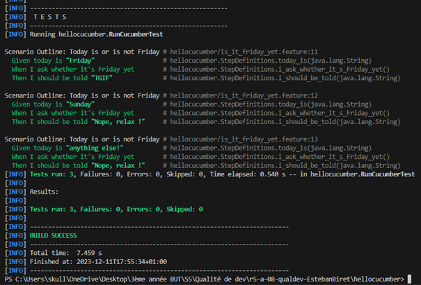

= R5.A.08 -- Dépôt pour les TPs
:icons: font
:MoSCoW: https://fr.wikipedia.org/wiki/M%C3%A9thode_MoSCoW[MoSCoW]

Ce dépôt concerne les rendus de mailto:esteban.biret-toscano@etu.univ-tlse2.fr[Esteban BIRET-TOSCANO].

== TP1

Contenu du fichier `is_it_friday_yet.feature` :
[source,java]
---
Feature: Is it Friday yet?
Long live Saturday!
  Scenario Outline: Today is or is not Friday
    Given today is "<day>"
    When I ask whether it's Friday yet
    Then I should be told "<answer>"
  Examples:
    | day            | answer |
    | Friday         | TGIF   |
    | Sunday         | Nope, relax ! |
    | anything else! | Nope, relax ! |
---

Capture d'écran de l'exécution avec succès des tests :

== TP2 à suivre
